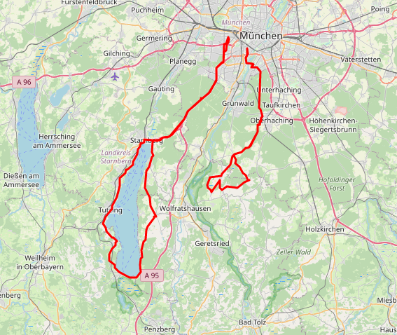

# GPX PLOT
* plot multiple GPX tracks and save map to html file
* gpx file parser **gpx-py**: https://github.com/tkrajina/gpxpy
* **folium** maps: https://python-visualization.github.io/folium/modules.html

### basic env settings:
* folder with .gpx files
* map type
* lat, long with initial alignment
